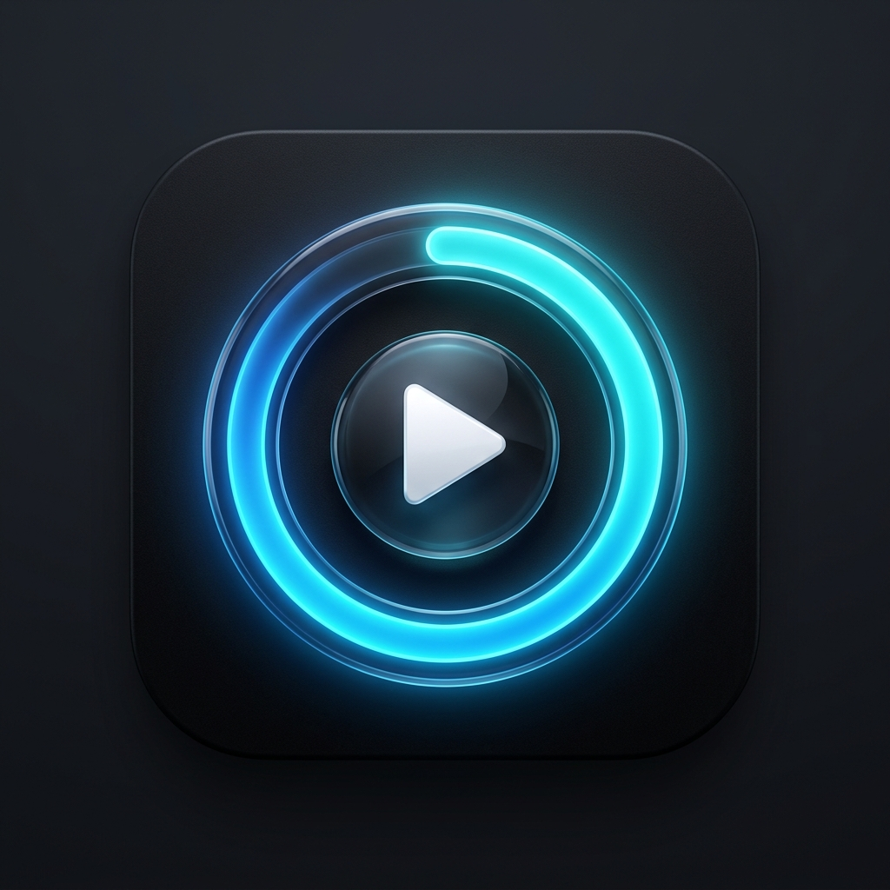

# Video Flow - Premium Playback Enhancement

Video Flow is a modern Chrome extension designed to elevate your video media consumption. It replaces/augments standard video player progress bars with a customizable, high-fidelity UI overlay and a dynamic circular HUD.

## 🚀 Features

- **Customizable Progress Bar**: Adjust the height and color of the progress bar to match your aesthetic.
- **Dynamic Circular Indicator**: A glanceable HUD in the corner of your video showing real-time percentage.
- **Glassmorphic Design**: Modern UI elements with backdrop blur and smooth animations.
- **Ultra Lightweight**: Zero-latency rendering using hardware-accelerated CSS.
- **Universal Support**: Works on YouTube, Vimeo, and most HTML5 video players.
- **Local File Support**: Enhance your offline videos opened in Chrome.
- **Fullscreen Optimized**: UI intelligently follows the video into fullscreen mode.

## 🛠 Installation (Developer Mode)

1. Download or clone this repository.
2. Open Google Chrome and navigate to `chrome://extensions/`.
3. Enable **Developer mode** in the top-right corner.
4. Click **Load unpacked** and select the `video-progress-style` folder.

### 📁 Enabling Local File Support
To use this extension with offline videos (e.g., `.mp4` files opened from your computer):
1. Go to `chrome://extensions/`.
2. Click **Details** on the Video Flow card.
3. Scroll down and toggle **Allow access to file URLs** to ON.

## 🎨 Customization

Click the **Video Flow icon** in your extension toolbar to:
- Change the progress bar color using a hex picker.
- Adjust the bar thickness (2px to 12px).
- Select from premium presets like *Cyberpunk*, *Minimal*, and *Electric Purple*.

## 📄 Privacy & Security

Video Flow does not collect any user data, browsing history, or personal information. All settings are stored locally using `chrome.storage.sync`.

## 📜 License

MIT License. See `LICENSE` for more details.
